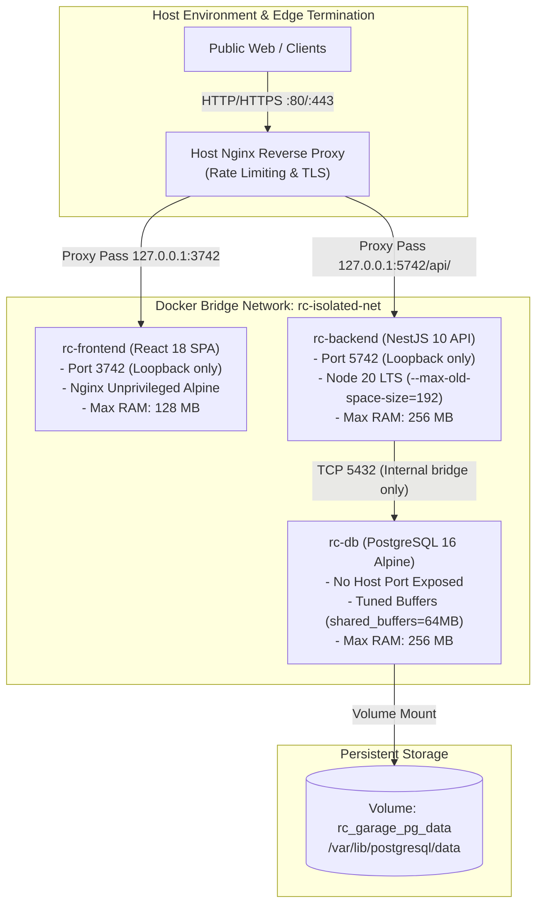
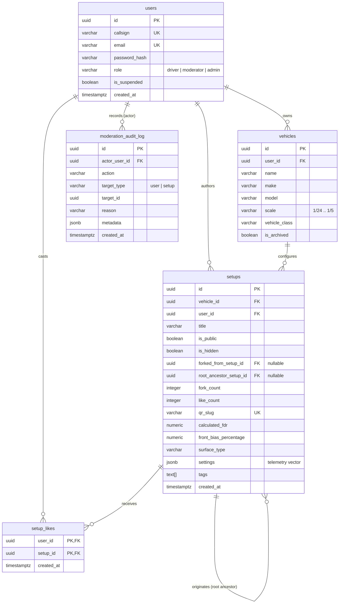
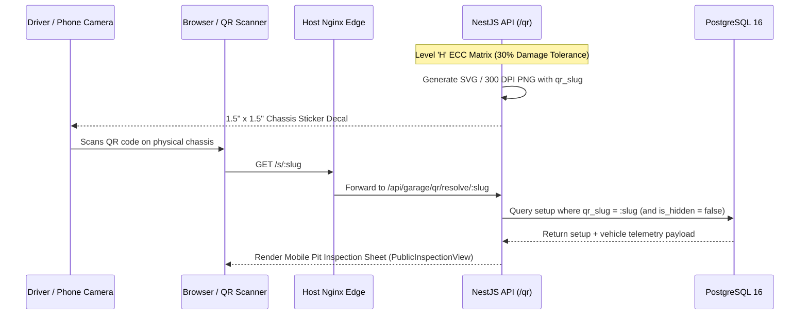

# RC Car & Rock Crawler Garage — Architectural Brief & System Topology

This document provides a concise, high-level architectural synthesis of the **RC Car & Rock Crawler Garage & Setup Logger**. It details system topology, network security boundaries, container memory allocations, relational and JSONB schemas, mathematical telemetry models, and lineage graph mechanics.

For the exhaustive engineering specification, refer to [`TECHNICAL_SPECIFICATION.md`](./TECHNICAL_SPECIFICATION.md).

---

## 1. System Topology & Network Isolation

The platform utilizes a containerized micro-architecture designed to run with minimal overhead on cost-effective virtual machines (e.g., 1GB/2GB RAM cloud instances).

### Key Network & Security Axioms
1. **Host Loopback Binding:** Only ports `127.0.0.1:3742` (frontend) and `127.0.0.1:5742` (backend) bind to the host loopback. They are never exposed directly to public network interfaces.
2. **Database Isolation:** PostgreSQL (`rc-db`) exists exclusively within the private Docker bridge network (`rc-isolated-net`). No port `5432` is mapped to the host, protecting relational telemetry from unauthorized external scans.
3. **Deterministic Memory Caps:** Total container memory is capped at **640MB combined** (`128M` frontend + `256M` backend + `256M` database). The backend Node.js runtime is constrained via `--max-old-space-size=192` to prevent heap-induced container termination.

---

## 2. Relational Schema & Fork Lineage Graph

The database uses PostgreSQL 16 combining strict foreign-key integrity for core entities with high-performance JSONB storage for complex mechanical setup vectors.

### Fork Lineage & Immutability Contract
- When driver $B$ forks a setup created by driver $A$, a completely decoupled snapshot of the setup sheet is inserted into driver $B$'s vehicle garage.
- The record establishes two immutable lineage pointers:
  - `forked_from_setup_id`: Points directly to driver $A$'s setup.
  - `root_ancestor_setup_id`: Points to the original progenitor setup of the entire lineage branch.
- Foreign keys declare `ON DELETE SET NULL`. If an ancestor setup is deleted, child setups maintain their independent configuration while safely unlinking the lineage pointer without cascading data loss.

---

## 3. Telemetry Mathematics & Calculation Engine

The platform incorporates real-time mechanical equations to compute drive characteristics and chassis balance.

### 3.1 Final Drive Ratio (FDR)
Final Drive Ratio determines the number of motor revolutions required to rotate the drive wheels once:

$$\text{FDR} = \left(\frac{\text{Spur Gear Teeth}}{\text{Pinion Gear Teeth}}\right) \times \text{Internal Transmission Ratio}$$

*Example:* Spur $56\text{T}$, Pinion $14\text{T}$, Internal Ratio $2.60$:
$$\text{FDR} = \left(\frac{56}{14}\right) \times 2.60 = 4.0 \times 2.60 = 10.40$$

### 3.2 Rollout (Distance Traveled)
Rollout defines the linear distance (in millimeters) traveled by the vehicle per single motor revolution:

$$\text{Rollout} = \frac{\text{Tire Outer Diameter (mm)} \times \pi}{\text{FDR}}$$

### 3.3 Center of Gravity (CoG) Front Weight Bias Percentage
Chassis corner scales measure wheel loads to determine front-to-rear mass balance:

$$\text{Front Bias \%} = \frac{\text{Front Left Weight} + \text{Front Right Weight}}{\text{Gross Vehicle Weight}} \times 100$$

$$\text{Gross Weight} = W_{\text{FL}} + W_{\text{FR}} + W_{\text{RL}} + W_{\text{RR}}$$

*Rule of thumb for competition rock crawlers:* Optimal climbing performance targets a **$58\% - 62\%$ front weight bias** to maximize steering bite and resist backward rollovers on steep inclines.

### 3.4 Shock Damper Viscosity Normalization
RC dampener fluids are rated either by CST (Centistoke kinematic viscosity) or WT (Weight index). The backend maintains a normalized lookup mapping so racers can input either unit and compare setups accurately.

---

## 4. QR Engine & Chassis Sticker Pipeline

The QR engine bridges digital setup sheets to physical chassis on the track or crawling trail.

1. **Error Correction Level 'H':** QR codes encode data with Reed-Solomon Error Correction Level 'H' (High), tolerating up to **30% surface occlusion** from track mud, tire grime, and lexan chassis scrapes.
2. **Standardized Decal Format:** Sized precisely for **1.5" x 1.5" (38mm x 38mm)** vinyl decals commonly applied to RC rock bouncer roofs and touring car chassis undertrays.
3. **Edge Route `/s/:slug`:** Short URL footprint minimises QR matrix density, making codes fast to scan even with budget smartphone cameras in low-light pit conditions.

---

## 5. Security & Scrutineering Desk (Moderation)

1. **Authentication:** Stateless JSON Web Tokens (JWT) signed with SHA-256 HMAC secrets, verified via `JwtAuthGuard`. Passwords hashed with bcrypt (salt cost 10).
2. **Role Hierarchy:**
   - `driver`: Standard authenticated user (garage fleet, setup clipboard, feed, likes).
   - `moderator`: Community safety operator (accesses `/admin`, suspends drivers, force-hides offensive setups).
   - `admin`: Platform owner (manages roles, permanent deletions, system overview, immutable audit trail).
3. **Audit Log:** Every administrative intervention writes an immutable record to `moderation_audit_log` detailing actor UUID, action type, target UUID, reason, and JSON metadata.
